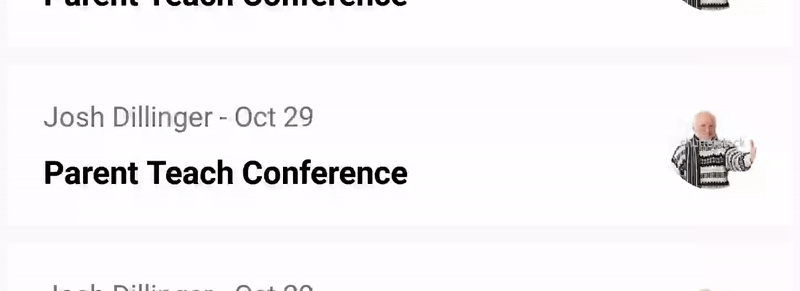

# Covert



[  ](https://bintray.com/trademe/Covert/covert/_latestVersion)

 Covert is an Android Library for easily implementing Material Swipe Actions in a RecyclerView. The design of the animations was based heavily around the [Swipe Action Gestures](https://material.io/design/interaction/gestures.html#types-of-gestures) demonstrated in the Material Interaction guidelines.

## Download

```groovy
implementation 'nz.co.trademe.covert:covert:2.0.1'
```

## Usage
A setup of Covert matching the demo takes three steps
1. Set up your configuration - this is what tells Covert what to draw
```kotlin
val covertConfig = Covert.Config(
        iconRes = R.drawable.ic_star_border_black_24dp, // The icon to show
        iconDefaultColorRes = R.color.black,            // The color of the icon
        actionColorRes = R.color.colorPrimary           // The color of the background
)
```
2. Build Covert by defining your listeners and attaching to your `RecyclerView`
```kotlin
val covert = Covert.with(covertConfig)
                .setIsActiveCallback {
                    // This is a callback to check if the item is active, i.e checked
                    repository.isActive(it.adapterPosition)
                }
                .doOnSwipe { viewHolder, _ ->
                    // This callback is fired when a ViewHolder is swiped
                    repository.toggleActiveState(viewHolder.adapterPosition)
                }
                .attachTo(recyclerView)
```
3. Pass Covert to your adapter to apply your corner flags
```kotlin
override fun onBindViewHolder(viewHolder: RecyclerView.ViewHolder, index: Int) {
    covert.drawCornerFlag(viewHolder)
    ...
}
```
## Swipe Refresh Layouts
In some cases, swipe refresh layouts may consume touch events that Covert uses, leading to janky animations. To address this, you can add the following line to the builder.
```kotlin
Covert.with(covertConfig)
                .setIsActiveCallback { ...}
                .doOnSwipe { viewHolder, _ -> ...}
                .disablePullToRefreshOnSwipe(swipeRefreshLayout)
                .attachTo(recyclerView)
```

## Optimisations
Covert notifies the `RecyclerView` that the current `ViewHolder` has changed for each frame it draws. If the layout your using is complicated, this can sometimes drop frames and cause weird behaviour. To work around this, Covert triggers invalidations using a payload, which you can look for to skip a full rebind of your `ViewHolder`:

```kotlin
override fun onBindViewHolder(holder: RecyclerView.ViewHolder, position: Int, payloads: List<Any>) {
    // The following is an optimisation for Covert, allowing us to skip re-binding of ViewHolders if only drawing the child
    if (payloads.size == 1 && payloads.contains(Covert.SKIP_FULL_BIND_PAYLOAD)) return
    ...
}
```
## Advanced Setup
Covert tries to make set up as easy as possible. It does however support more advanced setup:
```kotlin
Covert.Config(
        // Define the icon to show in an active state, with start and end colors 
        activeIcon = Icon(
            iconRes = R.drawable.ic_active,
            startColorRes = R.color.start,
            endColorRes = R.color.end),

        // Define the icon to show in an inactive state, with start and end colors 
        inactiveIcon = Icon(
            iconRes = R.drawable.ic_inactive,
            startColorRes = R.color.end,
            endColorRes = R.color.start),
        
        // Define the backdrop color of the active background
        activeBackdropColorRes = R.color.green,

        // Define the backdrop color of the inactive background
        inactiveBackdropColorRes = R.color.red,

        // Toggle on and off haptic feedback (available in simple constructor)
        isHapticFeedbackEnabled = (true | false),

        // Choose your cornerflag (available in simple constructor)
        cornerFlag: CornerFlag = (CornerFlag.Round | CornerFlag.Triangular | CornerFlag.Custom(R.dimen.size, R.drawable.flag) | CornerFlag.Disabled)
)
```
## Contributing

We love contributions, but make sure to checkout `CONTRIBUTING.MD` first!

